🔐 Login GITHUB (If we don’t have local setup then work in the GIT repo steps) 🚀

📁 ➕Step 1: Create a new repository
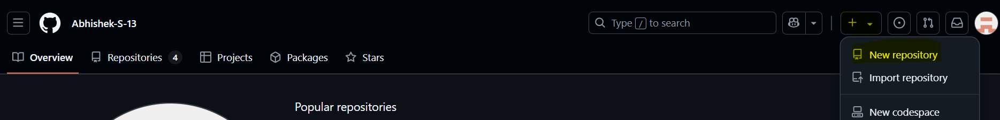

📝 👤 Step 2: Add your details
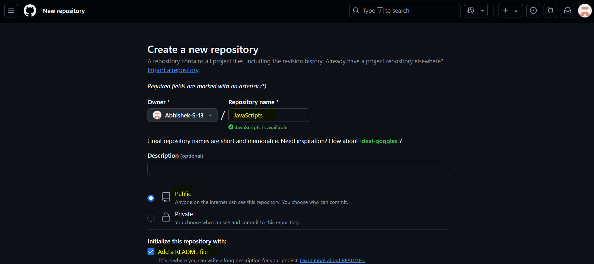

💻 🛠️ Step 3: if you don’t have local setup in your laptop then you can create it in git
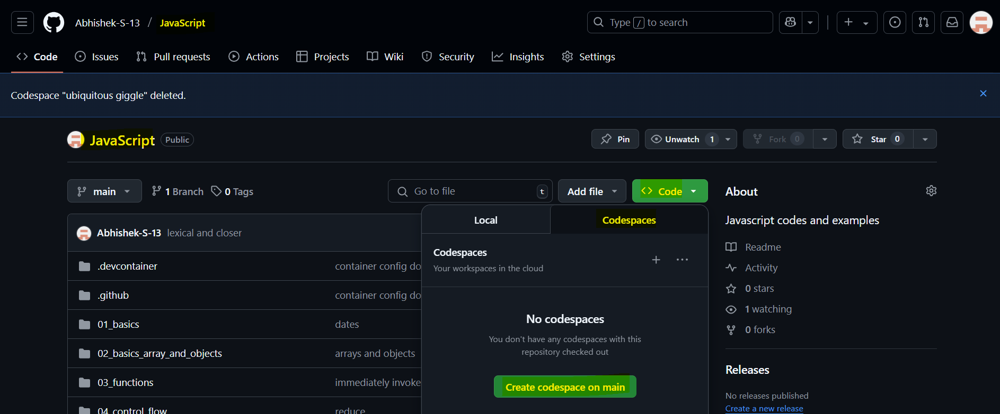

🟢📦 Step 4: we have to add NodeJS by using the following steps
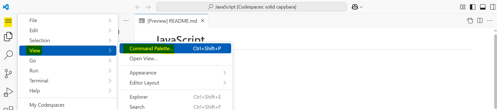

🔍📦⚙️ Step 5: search container - Adds Dev container configuration
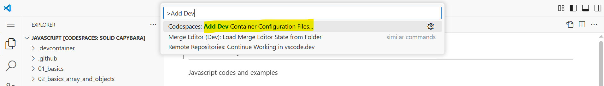

🆕⚙️ Step 6: select Create a new configuration
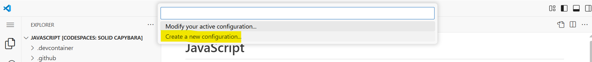

📂🔢 Step 7: select Node and add number default
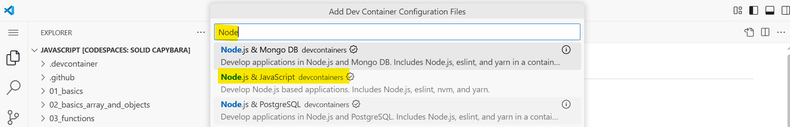

🗑️⏱️🔧Step 8: For saving time alignment in git, we must delete this.
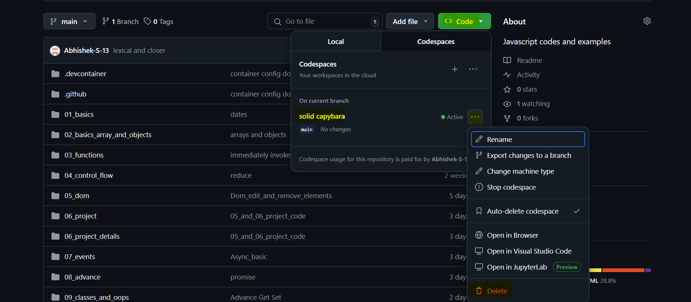

🎨🌑Step 9: to change the color theme in the git set to Dark  
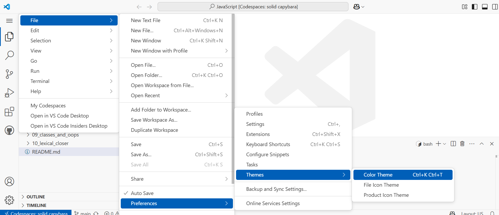

✅🌈Step 10: final color set
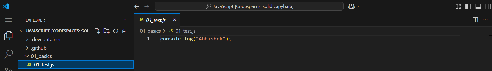

🔀✉️➕ Step 11: merge it to git add message add + of all objects
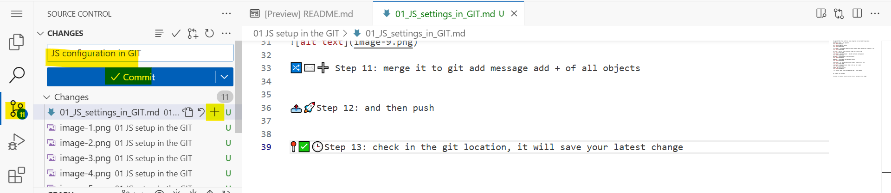

📤🚀Step 12: and then push
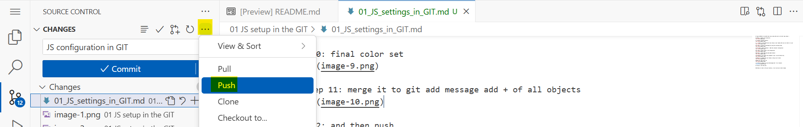

📍✅🕒Step 13: check in the git location, it will save your latest change